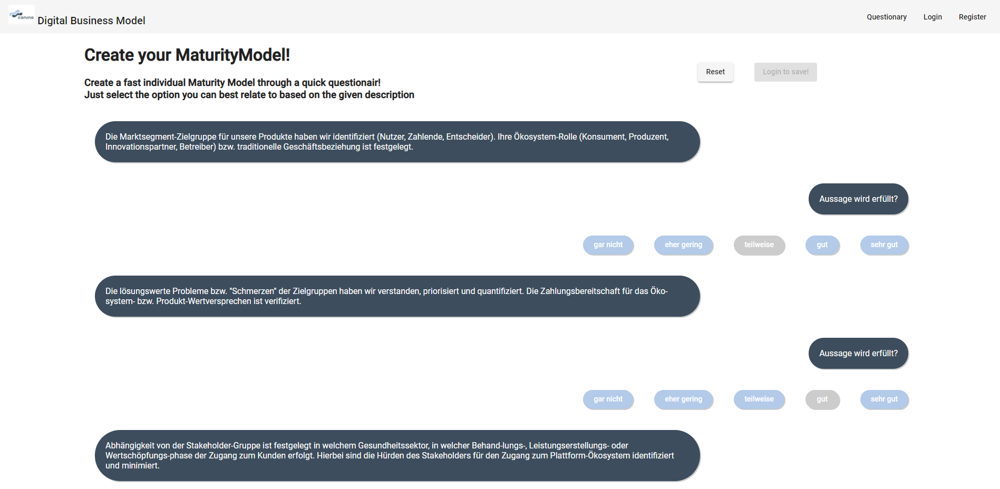
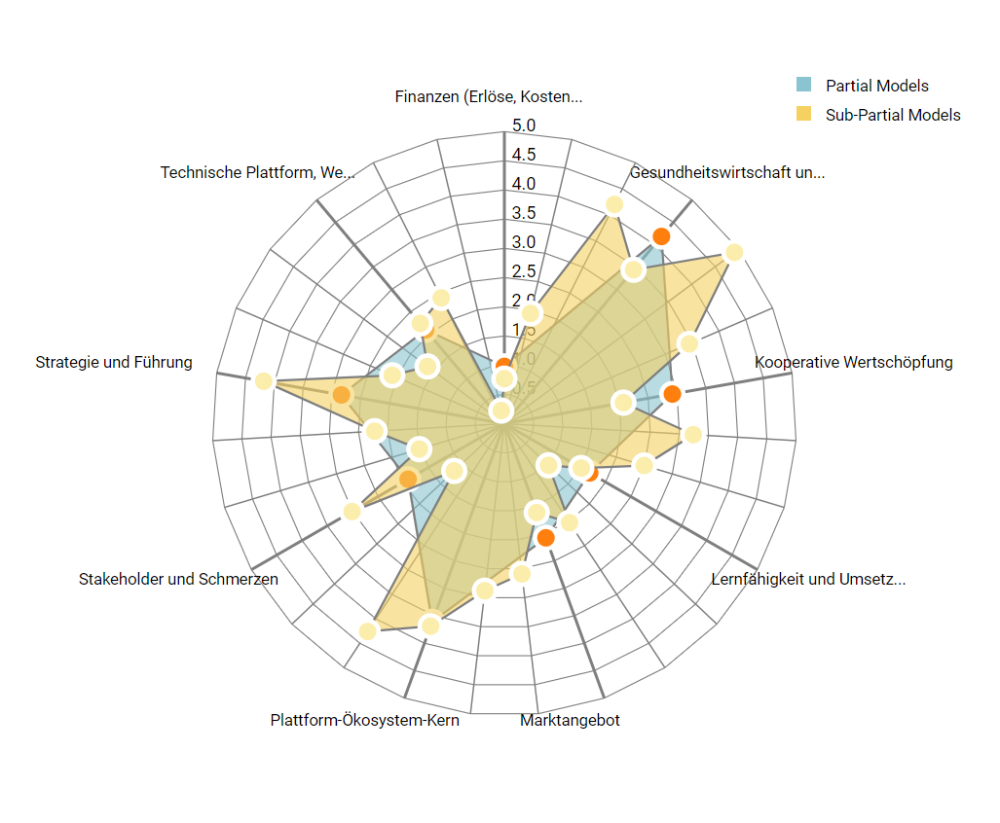
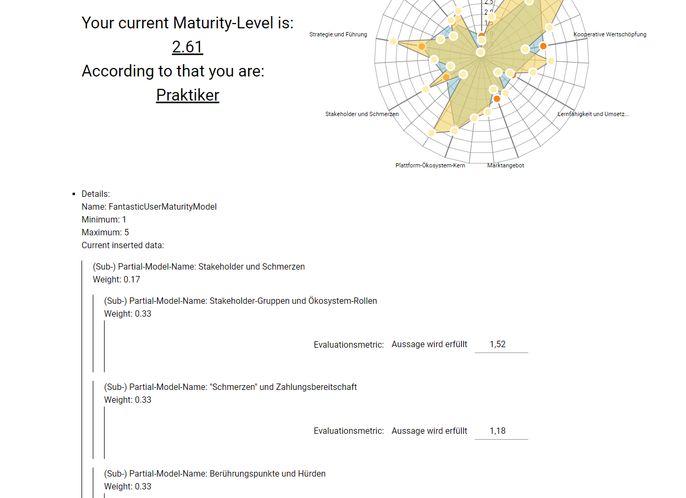

# Conino-BMA
This project is a Business-Model-Analysis (BMA) tool and helps to develop and evaluate your current business-model in public health care. This project is part of the conino-venture. This repository is all about the front-end-part of the project. The back-end-part can be found [here](https://github.com/FlorianTh2/Conino-BMA-Backend).







## Prerequisites
- yarn
- Node v12+

## Getting Started

```$ git clone git@github.com:FlorianTh2/BusinessModelDigitalHealth.git```

```$ cd ./Conino-BMA```

```$ npm install```

```$ ng serve --open```

## Documentation: Angular Modules and Componentes
- app-module
    - auth-module
        - contains auth-related components
        - routes: /auth/login, /auth/register, /auth/logout
        - components: login, logout, register + utility
    - home-module
        - contains landing-page 
        - routes: /home
        - components: additional components for initial testing
    - project-module
        - contains project-related components
        - routes: /project, /project/x/projectelements
        - components:
            - project-picker + project-picker-card: select your project
            - projectelement-picker + projectelement-picker-card: select your projectelement to work with
    - questionary-module
        - module is related to create a questionary to quickly capture the current situation of the user
        - routes: /questionary
        - components:
            - qa-list: contains the whole qa-functionality and utilizes a redux store and create a queue for a series of messages (/ questions) and provides the possibility to create a maturity-model for the user
            - qa-message: display each message (/question)
    - maturity-model-module
        - provides general functionality to get deeper insights into given maturity-model and edit these
        - route: /project/x/projectelements/maturitymodel/y
        - components:
            - display-partial-model: recursivly display all included sub-partial-models inside a editable manner
    - graphql-module
        - location for JWT- and grahpql- apollo- related things
        - reponsible for placing the JWT in to the http-header also though the apollo-pipeline
        - location for the custom graphql-queries which have to be converted into code by the graphql-codegen-package
        - location for generated graphql-codegen code
    - core-module
    - material-module
        - basic module to include angular material classes for convenience
    - static-sites-module
        - responsible for static sites like /about, /impressum, /privacy
    - shared-module
        - contains cross-module shared things e.g. header, sidenav, footer, models, date-pipe,
    - store
        - contains root-reducer

## Important commands
- start application
```$ ng serve```

- generate graphql-types via codegen
```$ yarn codegen```

## Build with
- yarn v1.22
- node v12
- typescript v4
- angular v11
- graphql v15.5
- apollo-client v3
- d3 v6.3
- jwt-decode v3.1

## Acknoledgements
- Thanks to my supervisor Mr. T.Knape@Charité Berlin for the help with this student project
